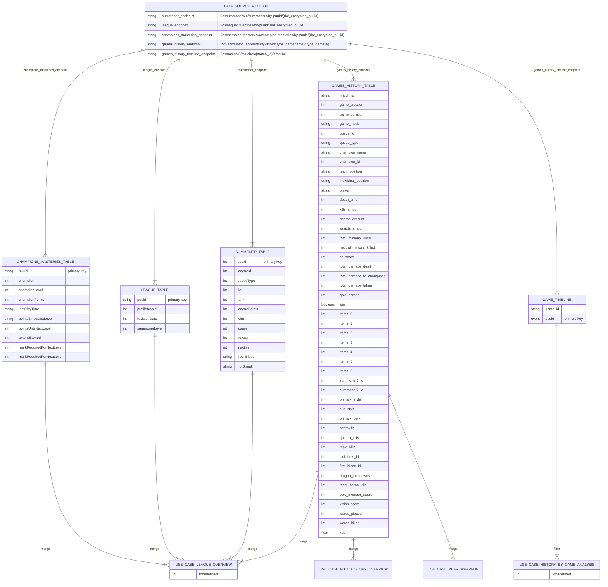

```mermaid
erDiagram

    %% ALL DATA SOURCE
    DATA_SOURCE_RIOT_API {
        string summoner_endpoint "/lol/summoner/v4/summoners/by-puuid/{riot_encrypted_puuid}"
        string league_endpoint "/lol/league/v4/entries/by-puuid/{riot_encrypted_puuid}"
        string champions_masteries_endpoint "/lol/champion-mastery/v4/champion-masteries/by-puuid/{riot_encrypted_puuid}"
        string games_history_endpoint "/riot/account/v1/accounts/by-riot-id/{type_gamename}/{type_gametag}"
        string games_history_timeline_endpoint "/lol/match/v5/matches/{match_id}/timeline"
    }

    %% DATA COLLECTED
    LEAGUE_TABLE {
        string puuid "primary key"
        int profileIconId
        int revisionDate
        int summonerLevel
    }
    SUMMONER_TABLE {
        int puuid "primary key"
        int leagueId
        int queueType
        int tier
        int rank
        int leaguePoints
        int wins
        int losses
        int veteran
        int inactive
        string freshBlood
        string hotStreak
    }
    CHAMPIONS_MASTERIES_TABLE {
        string puuid "primary key"
        int champion
        int championLevel
        int championPoints
        string lastPlayTime
        string pointsSinceLastLevel
        int pointsUntilNextLevel
        int tokensEarned
        int markRequiredForNextLevel
        int markRequiredForNextLevel

    }
    GAME_TIMELINE {
        string game_id 
        event puuid "primary key"

    }
%% USE CASE
USE_CASE_LEAGUE_OVERVIEW{
    int tobedefined
}


USE_CASE_HISTORY_BY_GAME_ANALYSIS{
    int tobedefined
}

GAMES_HISTORY_TABLE {
    string match_id
    int game_creation
    int game_duration
    string game_mode
    int queue_id
    string queue_type
    
    string champion_name
    int champion_id
    string team_position
    string individual_position
    
    string player
    int death_time
    int kills_amount
    int deaths_amount
    int assists_amount
    
    int total_minions_killed
    int neutral_minions_killed
    int cs_score
    
    int total_damage_dealt
    int total_damage_to_champions
    int total_damage_taken
    int gold_earned
    boolean win

    int items_0
    int items_1
    int items_2
    int items_3
    int items_4
    int items_5
    int items_6

    int summoner1_id
    int summoner2_id

    int primary_style
    int sub_style
    int primary_perk

    int pentakills
    int quadra_kills
    int triple_kills
    int skillshots_hit
    int first_blood_kill
    int dragon_takedowns
    int team_baron_kills
    int epic_monster_steals

    int vision_score
    int wards_placed
    int wards_killed
    
    float kda
}


    DATA_SOURCE_RIOT_API ||--|{ CHAMPIONS_MASTERIES_TABLE : champions_masteries_endpoint
    DATA_SOURCE_RIOT_API ||--|{ LEAGUE_TABLE : league_endpoint
    DATA_SOURCE_RIOT_API ||--|{ SUMMONER_TABLE : summoner_endpoint
    DATA_SOURCE_RIOT_API ||--|{ GAMES_HISTORY_TABLE : games_history_endpoint
    DATA_SOURCE_RIOT_API ||--|{ GAME_TIMELINE : games_history_timeline_endpoint


    CHAMPIONS_MASTERIES_TABLE ||--|{ USE_CASE_LEAGUE_OVERVIEW : merge
    LEAGUE_TABLE||--|{ USE_CASE_LEAGUE_OVERVIEW : merge
    SUMMONER_TABLE||--|{ USE_CASE_LEAGUE_OVERVIEW : merge
    GAMES_HISTORY_TABLE ||--|{ USE_CASE_LEAGUE_OVERVIEW : merge
    GAMES_HISTORY_TABLE ||--|{ USE_CASE_FULL_HISTORY_OVERVIEW : merge
    GAMES_HISTORY_TABLE ||--|{ USE_CASE_YEAR_WRAPPUP : merge

    GAME_TIMELINE ||--|{ USE_CASE_HISTORY_BY_GAME_ANALYSIS : filter
    
```