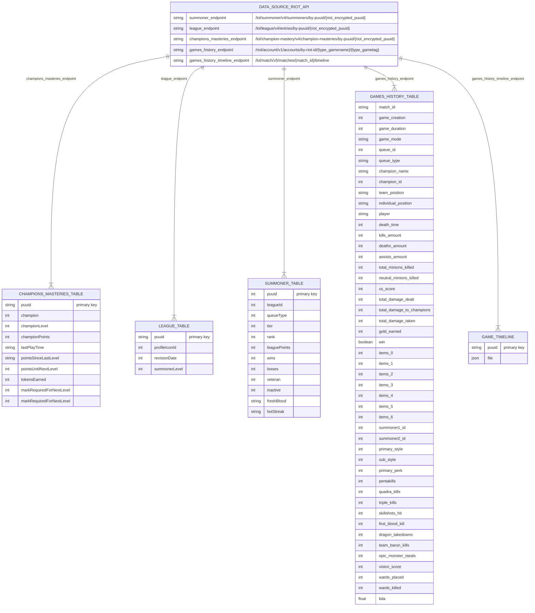

#  League of Legends Rift Rewind Hackathon Coach
<div align="center">
  
</div>

> [!NOTE]  
> [Click here to access to the frontend repo](https://github.com/travisseng/hackathon-site)


## Summary 

- [1. Project Overview](#1-project-overview)
- [2. Features](#2-features)
- [3. AWS Services](#3-aws-services)
- [4. Technical Stack](#4-technical-stack)
- [5. Data Flow](#5-data-flow)
- [6. How the Coaching Agent Works](#6-how-the-coaching-agent-works)
- [7. Folder Structure](#7-folder-structure)
- [8. Team / Authors](#8-team--authors)
- [9. License](#9-license)

## 1. Project Overview


*Game by game analysis with your personnal agent*

The **League of Legends Data Intelligence** project combines data analytics, AI coaching, and year-end summaries to help players better understand their in-game performance.  
Inspired by **Spotify Wrapped** and **Op.gg**, the platform offers a personalized, data-driven experience that’s both fun and insightful.  

It allows players to:
- Visualize their **yearly highlights** (kills, deaths, KDA, most played champions).  
- Get **AI-based coaching** tailored to each match.  
- Track their **progression throughout the year** across multiple performance metrics.  

The goal is to make advanced analytics **accessible to every player**, providing actionable insights that can be directly applied to future games.

## 2. Features

- 🧾 **Wrapped Up Summary** – Generates a yearly report of your performance with key stats like kills, pentakills, winrate, and most played champions. It creates a shareable summary card for social fun.

<div align="center">
  
</div>

- 🧠 **AI Coaching Agent** – Analyzes your games using benchmark data from Diamond and Master players. Provides improvement suggestions and highlights strong points to maintain.
- 💬 **Phase-Based Insights** – Breaks down every match into early, mid, and late game to deliver precise recommendations adapted to each phase.
  
<div align="center">
  
</div>

- 📈 **Evolution Tracking** – Follows your key performance indicators (KDA, damage, deaths) month by month, helping you visualize progress over time.
  
<div align="center">
  
</div>

- 📊 **Yearly Shareable Card** – A visual **summary card** that compiles your key stats from the year in an easy-to-share format, perfect for posting on social media or sharing with friends.
  
<div align="center">
  
</div>

- ☁️ **AWS-Powered Architecture** – Uses AWS Lambda, Bedrock, and S3 for scalable, serverless data processing and real-time access.  


## 3. AWS Services

Our architecture is fully cloud-native and built for scalability:

- **AWS Lambda** – Handles data collection, processing, and analysis through modular functions.  
- **AWS S3** – Stores all player statistics, parsed JSON files, and analysis outputs.  
- **AWS Bedrock** – Enables LLM-driven reasoning on cleaned datasets and contextual analysis of matches.  
- **API Gateway** – Exposes endpoints (`/context`, `/summary_year`) for accessing processed data.  
- **Riot Games API** – Provides the raw game and player data that fuel our analytics pipeline.  

> This architecture allows the system to process match data in near real-time while keeping infrastructure costs low.

## 4. Technical Stack

**Languages & Frameworks**
- Python
- Pandas, Requests, Boto3  

**Cloud Infrastructure**
- AWS Lambda  
- AWS S3  
- AWS Bedrock  
- AWS API Gateway  
- AWS IAM (for secure roles and access control)

**Data Source**
- Riot Games API (match data, player stats, champion information)
- DPM data

**Infrastructure Philosophy**  
Our philosophy is to provide a **micro-level view of each game**, allowing users to apply concrete advice immediately, while also maintaining a **macro-level view** to observe long-term performance evolution. We also aim to provide **fun and shareable insights** so that players can compare their stats with friends and make the data more engaging and playful.


## 5. Data Flow

1. **Collection:** Data is fetched from the Riot Games API via Lambda.  
2. **Processing:** The data is parsed, cleaned, and structured into minimal JSON files.  
3. **Storage:** Processed data is saved in S3 buckets for fast retrieval.  
4. **Analysis:** Bedrock reads these datasets to generate insights using contextual prompts.  
5. **Delivery:** The API Gateway exposes the results through endpoints such as `/context` and `/summary_year`.

## 6. How the Coaching Agent Works

The **AI Coaching Agent** analyzes match data and benchmarks player performance against statistics from high-ranked players (Diamond and Master tiers).  
It considers both **quantitative KPIs** (KDA, DPM, objectives) and **qualitative context** (game phase, key events, team dynamics).  

- The analysis is divided into **early, mid, and late game phases**, each focusing on different skills: mechanics, macro management, and team strategy.  
- The agent produces **actionable feedback**, offering practical advice players can immediately apply in their next match.  
- KPIs are evaluated monthly, allowing the system to track performance progression analytically over time.  
- Each match and champion can also receive a **performance score**, making comparisons and improvement tracking intuitive.  

Example:
> A Kayle player will receive more early-game recommendations related to safe farming and wave management, while a Renekton player will get late-game insights about positioning and teamfight engagement.


## 7. Folder Structure

```
.
├── README.md
├── counters.json
├── images
│   ├── analysis.png
│   └── banner.png
└── lambdas
    ├── collection
    │   └── league_api_call
    │       ├── get_account_data.py
    │       ├── lambda_function.py
    │       └── module
    │           ├── __init__.py
    │           ├── endpoints_call.py
    │           └── parsing_template.py
    └── ui_integration
        ├── agentCall
        ├── callCoachAgentOneGame
        │   ├── all_game_data.py
        │   ├── item_mapper.py
        │   ├── lambda_function.py
        │   ├── module
        │   │   └── retrieve_account.py
        │   ├── parse_data.py
        │   └── query_timeline.py
        ├── getAccountData
        │   └── lambda_function.py
        ├── getAllMatchIds
        │   ├── lambda_function.py
        │   └── retrieveaccount.py
        ├── getAndReturn
        │   └── lambda_function.py
        ├── getContext
        │   └── lambda_function.py
        ├── getScoreSummary
        │   └── lambda_function.py
        ├── getSummaryyear
        │   └── lambda_function.py
        └── websocketRouter
            └── lambda_function.py
```
## 8. Architecture

### 1. AWS Architecture
<div align="center">
  
</div>

### 2. Data Collected



## 9. Team / Authors

👤 **[Alexandre Coulomb](https://github.com/Skytchup)** *Solution Architect Engineer*

👤 **[David Thak](https://github.com/Datha4)** - *NetDevOps Engineer*

👤 **[Travis Seng](https://github.com/travisseng)** - *Ph.D - Engineer in AI/Vision/NLP*

## 10. License

This project is released under the **MIT License**.  
Feel free to use, modify, and distribute it for educational or research purposes.  

---
