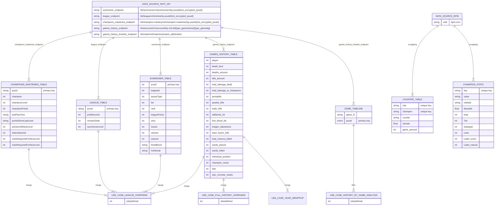

```mermaid
erDiagram

    %% ALL DATA SOURCE
    DATA_SOURCE_RIOT_API {
        string summoner_endpoint "/lol/summoner/v4/summoners/by-puuid/{riot_encrypted_puuid}"
        string league_endpoint "/lol/league/v4/entries/by-puuid/{riot_encrypted_puuid}"
        string champions_masteries_endpoint "/lol/champion-mastery/v4/champion-masteries/by-puuid/{riot_encrypted_puuid}"
        string games_history_endpoint "/riot/account/v1/accounts/by-riot-id/{type_gamename}/{type_gametag}"
        string games_history_timeline_endpoint "/lol/match/v5/matches/{match_id}/timeline"
    }
    DATA_SOURCE_DPM {
        string web "dpm.com"
    }

    %% DATA COLLECTED
    LEAGUE_TABLE {
        string puuid "primary key"
        int profileIconId
        int revisionDate
        int summonerLevel
    }
    SUMMONER_TABLE {
        int puuid "primary key"
        int leagueId
        int queueType
        int tier
        int rank
        int leaguePoints
        int wins
        int losses
        int veteran
        int inactive
        string freshBlood
        string hotStreak
    }
    CHAMPIONS_MASTERIES_TABLE {
        string puuid "primary key"
        int champion
        int championLevel
        int championPoints
        string lastPlayTime
        string pointsSinceLastLevel
        int pointsUntilNextLevel
        int tokensEarned
        int markRequiredForNextLevel
        int markRequiredForNextLevel

    }
    COUNTER_TABLE {
        string role "unique key"
        string champion "unique key"
        string counter 
        float winrate 
        int game_amount 
    }
    CHAMPION_STATS {
        string key "unique key"
        string value 
        string redside 
        float blueside 
        int total 
        int Tier 
        int Datatype 
        int Lane 
        int Label_score
        int Label_natural

    }
    GAME_TIMELINE {
        string game_id 
        event puuid "primary key"

    }
%% USE CASE
USE_CASE_LEAGUE_OVERVIEW{
    int tobedefined
}

USE_CASE_FULL_HISTORY_OVERVIEW{
    int tobedefined
}

USE_CASE_HISTORY_BY_GAME_ANALYSIS{
    int tobedefined
}

GAMES_HISTORY_TABLE{
    int player
    int death_time
    int deaths_amount
    int kills_amount
    int total_damage_dealt
    int total_damage_to_champions
    int pentakills
    int quadra_kills
    int triple_kills
    int skillshots_hit
    int first_blood_kill
    int dragon_takedowns
    int team_baron_kills
    int total_minions_killed
    int wards_placed
    int wards_killed
    int individual_position
    int champion_name
    int kda
    int epic_monster_steals
}

    DATA_SOURCE_RIOT_API ||--|{ CHAMPIONS_MASTERIES_TABLE : champions_masteries_endpoint
    DATA_SOURCE_RIOT_API ||--|{ LEAGUE_TABLE : league_endpoint
    DATA_SOURCE_RIOT_API ||--|{ SUMMONER_TABLE : summoner_endpoint
    DATA_SOURCE_RIOT_API ||--|{ GAMES_HISTORY_TABLE : games_history_endpoint
    DATA_SOURCE_RIOT_API ||--|{ GAME_TIMELINE : games_history_timeline_endpoint
    DATA_SOURCE_DPM ||--|{ COUNTER_TABLE : scrapping
    DATA_SOURCE_DPM ||--|{ CHAMPION_STATS : scrapping

    CHAMPION_STATS

    CHAMPIONS_MASTERIES_TABLE ||--|{ USE_CASE_LEAGUE_OVERVIEW : merge
    LEAGUE_TABLE||--|{ USE_CASE_LEAGUE_OVERVIEW : merge
    SUMMONER_TABLE||--|{ USE_CASE_LEAGUE_OVERVIEW : merge
    GAMES_HISTORY_TABLE ||--|{ USE_CASE_LEAGUE_OVERVIEW : merge
    GAMES_HISTORY_TABLE ||--|{ USE_CASE_FULL_HISTORY_OVERVIEW : merge
    GAMES_HISTORY_TABLE ||--|{ USE_CASE_YEAR_WRAPPUP : merge

    GAME_TIMELINE ||--|{ USE_CASE_HISTORY_BY_GAME_ANALYSIS : filter
    
```